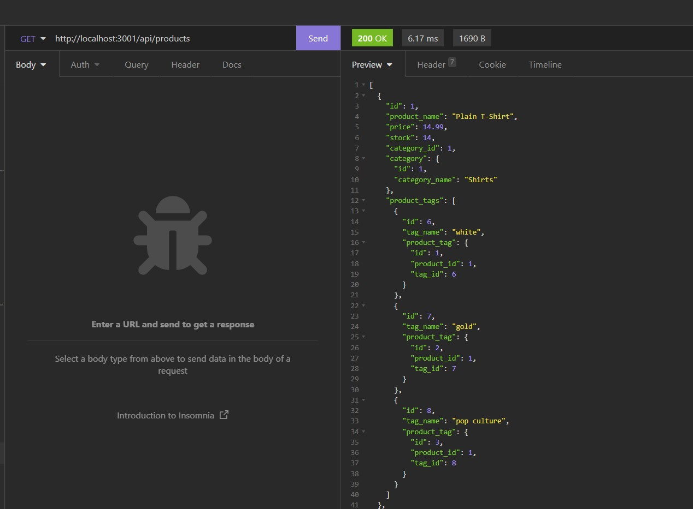

# Object-Relational Mapping (ORM) Challenge: E-commerce Back End

## Description

```
The client (a manager at an internet retail company) requested that
back end code be created to work with their e-commerce application.
The application is required to use Sequelize and MySQL. This application
tracks models for Category, Tag, and Product, which all need to relationally
connect. API endpoint calls need to be created so that they can interface
with the front end eventually.
```

## User Story

```
AS A manager at an internet retail company
I WANT a back end for my e-commerce website that uses the latest technologies
SO THAT my company can compete with other e-commerce companies
```

## Acceptance Criteria

```
- It is done when the user adds the database name, a MySQL username,
and a MySQL password to an environment variable (.env) file and is
the able to connect to the database using Sequelize.

- It is done when the user enters schema and seed commands in the
command line and then a development database is created and is
seeded with data.

- It is done when the user enters the command to invoke the application
and then the server is started and the Sequelize models are synced to
the MySQL database.

- It is done when the user opens the API GET routes in Insomnia for
categories, products, or tags and the data for each of these routes
is displayed in a formatted JSON.

- It is done when the user tests the API POST, PUT, and DELETE routes
in Insomnia and is able to successfully create, update, and delete
data in the database.
```

## Walkthrough Video

```
https://drive.google.com/file/d/1hg0SocvXzCwCFWTc6PwMMZUBq3_M9Ldo/view
```

The following image demonstrates the application functionality:



## Review

You are required to submit the following for review:

- A walkthrough video demonstrating the functionality of the application
  and all of the acceptance criteria being met: https://drive.google.com/file/d/1hg0SocvXzCwCFWTc6PwMMZUBq3_M9Ldo/view

- The URL of the GitHub repository: https://github.com/sstover25/e-commerce-back-end

---

## Installation

```
To use this application, you must have Node.js installed as well as
dotenv, express, mysql2, and sequelize installed.
```

## Credits

```
Coding assistance from KU bootcamp modules, https://sequelize.org/,
and Stack Overflow.
```

© 2021 Trilogy Education Services, LLC, a 2U, Inc. brand. Confidential and Proprietary. All Rights Reserved.
